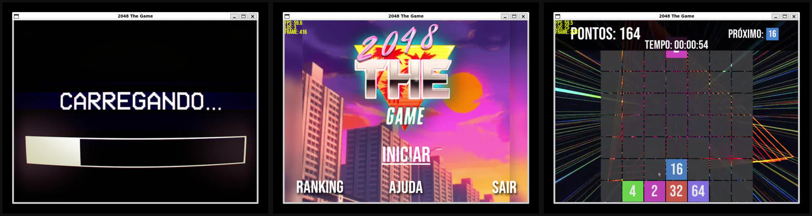

# 2048 The Game

Projeto acadêmico desenvolvido no primeiro semestre de Ciência da Computação
da Universidade Federal de Santa Maria (UFSM), em 2020, para a disciplina de
Laboratório de Programação I. O objetivo foi criar, em C com
[Allegro 5](https://liballeg.org/), um jogo inspirado em 2048.
Foi meu primeiro contato com a linguagem C e com a biblioteca Allegro.

Este é um projeto de arquivo: o código e os assets originais foram
preservados como foram encontrados, inclusive suas datas de modificação.

## Gameplay




## Executar

No Ubuntu/Debian, instale as dependências de compilação:

```sh
sudo apt install build-essential pkg-config liballegro5-dev
```

Depois, na raiz do projeto:

```sh
make
./allegro
```

`make run` compila, quando necessário, e inicia o jogo.

## Controles

- O jogo pode ser jogado inteiramente com o mouse: escolha a coluna no
  tabuleiro e use os botões da interface.
- Como alternativa, as setas esquerda/direita escolhem a coluna e a seta para
  baixo acelera a queda.
- Pressione `Esc` para abrir o menu de pausa.

O placar local é criado como `ranking.txt` ao executar o jogo e não é
versionado.

## Estrutura

- `allegro.c` — único arquivo-fonte do jogo.
- `source/` — fontes, imagens, animações e áudio usados pelo jogo; a
  animação de carregamento está em `source/loading/`.
- `Makefile` — atalho atual para compilação local, sem alterar a fonte.
